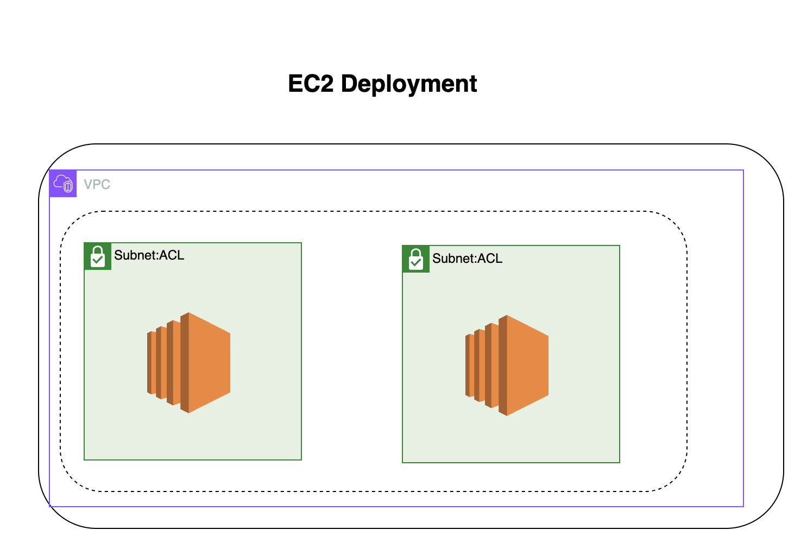

AWS VPC with EC2 and Database Subnets

## System Diagram

This project demonstrates how to create an AWS Virtual Private Cloud (VPC)
with a comprehensive network architecture for secure and scalable
infrastructure. The VPC includes:

    2 Public Subnets for hosting resources like load balancers, web servers,
      and other publicly accessible services.
    2 Private Subnets for EC2 instances running applications in a secure
      environment, isolated from the public internet.
    2 Private Subnets for Databases, ensuring that your database resources
      are securely placed behind firewalls with no direct access from the
      outside world.

The deployment is fully automated using AWS CDK to define the infrastructure
as code, allowing easy updates and re-deployment. This setup ensures high
availability and security by distributing resources across multiple
Availability Zones (AZs) within a region.

In ./lib/old-ec2-stack.ts there is a setup for the 2 EC2 Instances that
I'm sure is incorrect for deploying to specific AZ's, because we only
2 EC2 and 2 AZ's it was inevitable that they would go in the correct
place.
I am working on a way to do it, But it might be beyond me at the moment,
But I'm reading AWS docs and will figure it out soon before I move on
to adding the Databases to this project.
